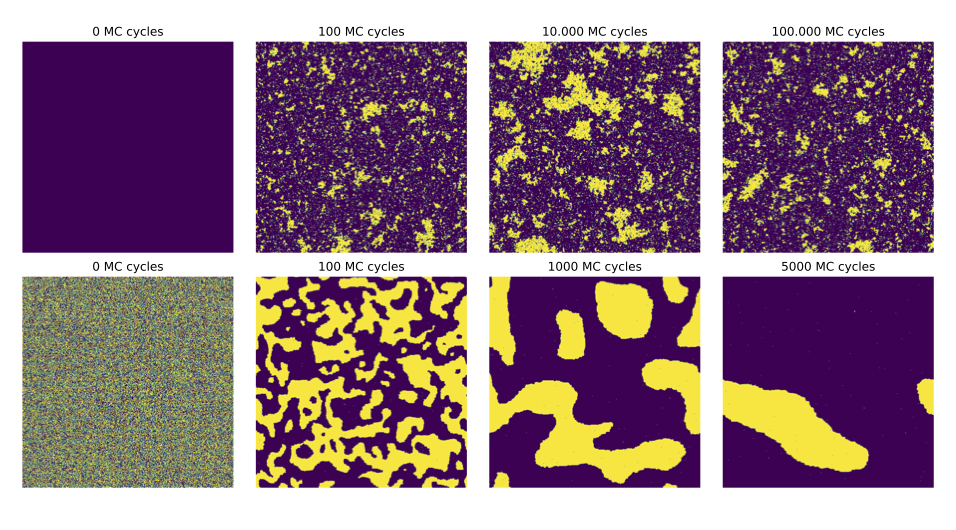

# Simulating a two-dimensional Ising model using the Metropolis-Hastings algorithm. 

## Abstract

The two-dimensional Ising model is used to study the phase transition of ferromagnets. To
simulate the model, we use a parallelized version of the Metropolis-Hastings algorithm. First, we
calculate the analytical solution of a model with a square $2\times2$ lattice and use the analytical results
to verify our implementation of the model. We found that for a $20\times20$ lattice, the model needs
approximately 105 Monte Carlo cycles to reach equilibrium. We estimate the probability distribution
of the expected energy per spin and found that the variance for the temperature $T = 1$ $J/kB$ was of
order 103 smaller than for the temperature $T = 2.4$ $J/kB$. When using OpenMP to parallelize our
code we made it run approximately 4 times faster using 8 threads. Lastly, we simulate the model
for four different lattice sizes to study the phase transition. We use these simulated values to find
an estimate of the critical temperature for an infinite Ising model. We find this to be 
$\approx 2.269282$ $J/kB$, which is close to the analytical result of $1 / \ln(1+\sqrt{2}) \approx 2.269185$  $J/kB$.

## Authors

- Sophus B Gullbekk (sophusbg@math.uio.no)
- Erlend Kristensen (erlek@math.uio.no)
- Tov Uberg Tyvold (tovut@math.uio.no)
- Jonathan Larsen (jonathel@math.uio.no) 

## Compile and run

For Linux users, in the file <code>src</code> write <code>$make OMP</code>
For Mac users, in the file <code>src</code> write <code>$make omp</code>

To recreate the results we found in our report the <code>laticeSizeComp</code> function in <code>main.cpp</code> has to be run with 8 threads.

## File structure

All the code for the project is located in the <code>src</code> folder.

The code for implementing the Ising model is located in the <code>IsingModel.cpp</code> and <code>IsingModel.hpp</code> files.

Other helpful functions for the Ising model is located in the <code>utilities.cpp</code> and <code>utilities.hpp</code> files.

The random number generator is located in the <code>omp_rng.cpp</code> and <code>omp_rng.hpp</code> files.

The code for generating results is located in the <code>main.cpp</code> file.

The code for plotting the figures used in the report is located in <code>plot.py</code>.

The data from our simulations is stored in the <code>textfiles</code> folder.
